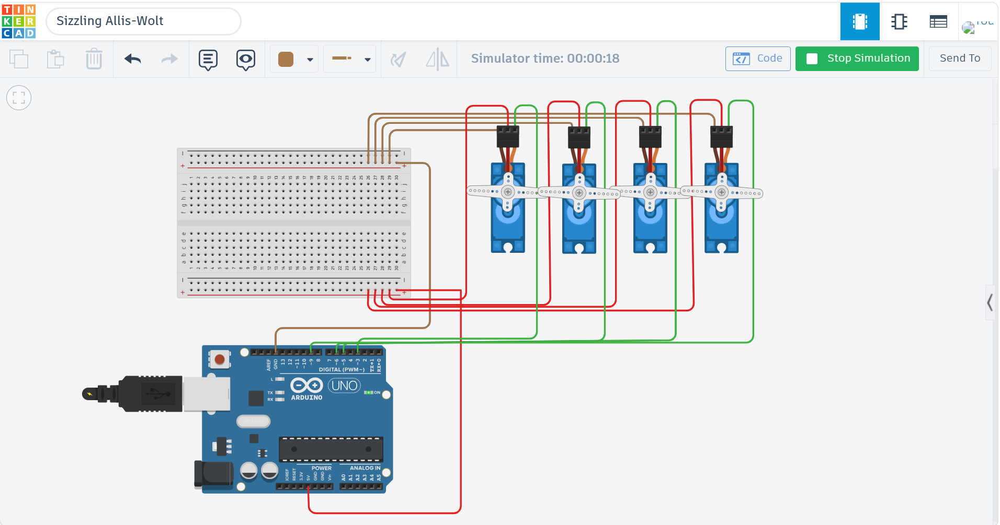

# Servo Motion Controller

## Overview
This project demonstrates a custom multi‑servo motion controller built using Arduino and Tinkercad.  
The goal was to create synchronized movement for four servo motors, followed by a controlled transition into a fixed angle.  
The behavior is fully time‑based to ensure consistent and predictable motion.

---

## Implementation Details
The controller performs two sequential behaviors:

### 1. Timed Sweep Motion (2 seconds)
All four servos move together from 0° → 180° → 0°.  
The sweep continues only for 2 seconds using `millis()` for accurate timing.

### 2. Fixed Angle Hold (90°)
After the sweep ends, all servos move to 90° and remain there.  
The program stops afterward to prevent repeated motion.

---

## Circuit
- Servo 1 → Pin 3  
- Servo 2 → Pin 5  
- Servo 3 → Pin 6  
- Servo 4 → Pin 9  
- VCC → 5V  
- GND → GND  

### Circuit Image


---

## Simulation Video
[Watch the simulation on YouTube](https://youtu.be/OqVgny5my_w)

---

## Code

```cpp
#include <Servo.h>

Servo s1;
Servo s2;
Servo s3;
Servo s4;

void setup() {
  s1.attach(3);
  s2.attach(5);
  s3.attach(6);
  s4.attach(9);
}

void loop() {

  unsigned long startTime = millis();

  while (millis() - startTime < 2000) {

    for (int angle = 0; angle <= 180; angle++) {
      s1.write(angle);
      s2.write(angle);
      s3.write(angle);
      s4.write(angle);
      delay(5);
    }

    for (int angle = 180; angle >= 0; angle--) {
      s1.write(angle);
      s2.write(angle);
      s3.write(angle);
      s4.write(angle);
      delay(5);
    }
  }

  s1.write(90);
  s2.write(90);
  s3.write(90);
  s4.write(90);

  while (true);
}
